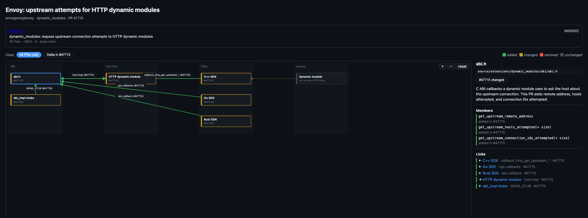
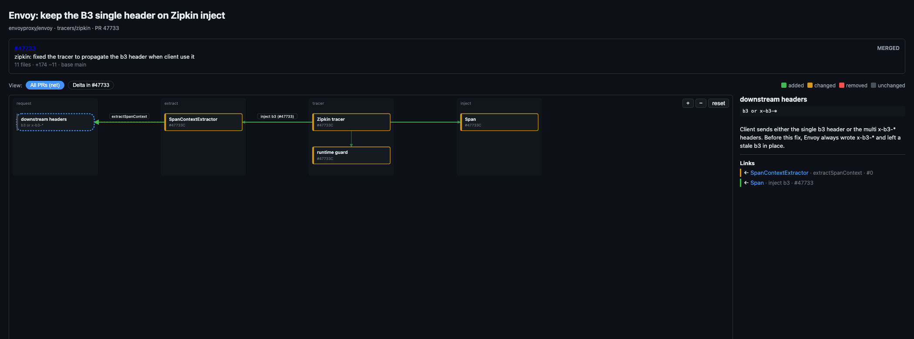
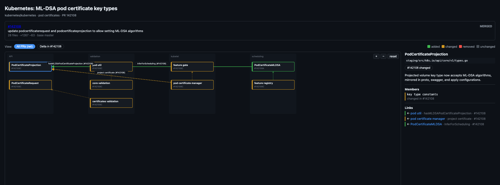

# pr-uml-diagram

Stop reading the diff line by line. Point an agent at the pull request and look at the design: which blocks were added, changed, or removed, and how they connect. The low-level design, as a diagram you can zoom, filter by PR, and click into.

Cursor and Claude Code skill that builds that diagram from one or more GitHub pull requests.

Copy this folder into a skills directory:

| App | All projects | One repo |
|---|---|---|
| Cursor | `~/.cursor/skills/pr-uml-diagram/` | `.cursor/skills/pr-uml-diagram/` |
| Claude Code | `~/.claude/skills/pr-uml-diagram/` | `.claude/skills/pr-uml-diagram/` |

Then ask for a UML or component diagram of a pull request. The agent writes a `data.json`; `scripts/build.py` renders a standalone HTML file.

## Examples

Open the HTML in a browser. Scroll to zoom, drag to pan, click a block for details.

[Envoy #47715](examples/envoy-47715.html) — upstream connection attempts for HTTP dynamic modules

[Envoy #47733](examples/envoy-47733.html) — Zipkin keeps the single `b3` header

[Kubernetes #142108](examples/k8s-142108.html) — ML-DSA pod certificate key types

